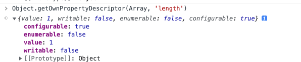

## Vue2.0 Object.defineProperty()

响应式：监听一个变量的变化，当变量变化时执行某些操作，类似于现在流行的前端框架（例如 `React`、`Vue等`）中的数据绑定功能，在数据更新时自动更新 `DOM` 渲染。

`Vue2.0`的响应式主要依靠`ES5`的`Object.defineProperty()`来实现。

### Q: Object.defineProperty() 缺点

- `IE8` 及更低版本 `IE` 是不支持的
- **无法监听到对象属性的 新增 或 删除操作**
- **无法监听到数组的变异方法（例：`push`/`pop`等），无法监听到数组的`length`属性变化**

#### Q: 为什么Object.defineProperty()无法监听到数组变异方法？
因为`Object.defineProperty()`无法劫持`length`变化。`length`的属性描述符如下：


   
数组对象中的 `length` 属性的 `configurable为` `false`，不允许访问器对该属性进行操作。所以无法重写其存取描述符(`getter/setter`)。


### 源码实现响应式
#### | 1.实现深度监听属性

```js
/**
 * 判断值是否为对象类型
 * @param val
 * @returns {boolean}
 */
function isObject(val) {
    return typeof val === 'object' && val !== null;
}

/**
 * 将对应变为响应式
 * @param obj
 */
function observe(obj) {
    if (!isObject(obj)) return obj;

    Object.entries(obj).forEach(([k, v]) => {
        reactiveObj(obj, k, v);
    })
}

/**
 * 劫持对象属性的变化，实现数据变更时，触发通知机制等操作
 * @param obj
 * @param key
 * @param value
 * @returns {*}
 */
function reactiveObj(obj, key, value) {
    // 子属性为对象，继续递归，进行响应式监听
    if (isObject(value)) observe(value);

    // 重新定义已有属性的getter/setter
    Object.defineProperty(obj, key, {
        set(newVal) {
            const oldVal = obj[key];

            if (oldVal !== newVal) {
                // 赋新值为对象时，进行深度监听
                if (isObject(newVal)) observe(newVal);

                obj[key] = newVal;
                // 当值发生改变时，触发通知机制，改变视图等
                // notify();
            }
        },
        get() {
            return obj[key];
        }
    })
};


// 使用
const obj = {list: [1, 2, 3], name: 'lily'};
reactiveObj(obj);
```

#### | 2.重写数组变异方法，实现调用时可以派发更新

```js
// 数组原型链的变异方法
const arrayProto = Array.prototype;
// 数组和其原型上，加了一层，其内容是自定义重写后的方法
const arrayMethods = Object.create(arrayProto);
// 七种需要主动拦截的数组变异方法
const methodsTopPatch = [
    'pop',
    'push',
    'shift',
    'unshift',
    'splice',
    'slice',
    'sort'
];

methodsTopPatch.forEach(methodName => {
    const origin = arrayProto[methodName];

    def(arrayMethods, methodName, function () {
        const args = [...arguments];
        const ob = this.__ob__;
        const result = origin.apply(this, args);

        // 获取到新增元素组成的数组
        let inserted;
        switch (methodName) {
            case 'push':
            case 'unshift':
                inserted = args;
                break;
            case 'splice':
                inserted = args.splice(2);
                break;
        }
        // 如果存在新增数组，则需要将新增的数组变为响应式数组
        if (inserted) ob.observeArray(inserted);

        // 通知依赖进行更新
        ob.dep.notify();

        // 返回原数组方法执行后结果
        return result;
    });

});

/**
 * 定义自己的数组方法，目的实现数据劫持
 * @param obj
 * @param key
 * @param value
 * @param enumerable
 */
function def(obj, key, value, enumerable) {
    Object.defineProperty(obj, key, {
        value,
        enumerable: !!enumerable,
        configurable: true,
        writable: true,
    })
}

/**
 * 将数组变为响应式数组
 * @param array
 */
Observer.prototype.observeArray = function (array) {
    for (let i = 0; i < array.length; i++) {
        observe(array[i]);
    }
}
```

#### 推荐阅读
- [为什么Object.defineProperty不能检测到数组长度的变化](https://burning-shadow.github.io/2019/04/25/%E4%B8%BA%E4%BB%80%E4%B9%88Object.defineProperty%E4%B8%8D%E8%83%BD%E6%A3%80%E6%B5%8B%E5%88%B0%E6%95%B0%E7%BB%84%E9%95%BF%E5%BA%A6%E7%9A%84%E5%8F%98%E5%8C%96/)
